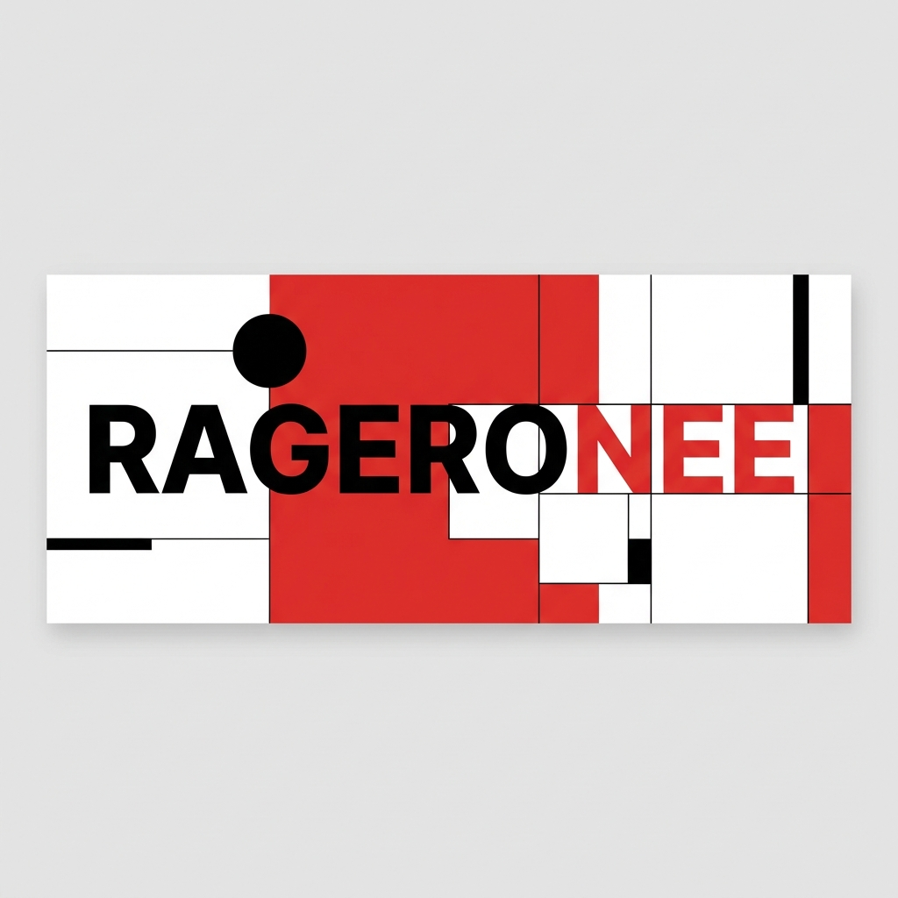

  

 

  <h1>HELLO.</h1>
  <h3>I AM RAGERONEE.</h3>
  
<b>FULL STACK DEVELOPER / CREATIVE TECHNOLOGIST</b>

 

<!-- SWISS GRID LAYOUT -->
<table border="0" width="100%" cellspacing="0" cellpadding="0">
  <tr>
    <td width="50%" valign="top">
      <h2>OBJECTIVE</h2>
      

        Currently focusing on <b>Rust</b>, <b>React</b>, and <b>System Architecture</b>.
        Building minimalist, functional, and high-performance digital experiences.
      

       
      <h2>CONTACT</h2>
      

        
         
        
      

    </td>
    <td width="50%" valign="top">
      <h2>TOOLKIT</h2>
      
      
      
       
      
      
      
       
      
      
      
    </td>
  </tr>
</table>

 

<!-- STATS GRID -->
<table border="0" width="100%">
  <tr>
    <td width="60%">
      
    </td>
    <td width="40%">
      
    </td>
  </tr>
</table>

 

  <i>DESIGNED WITH SWISS PRECISION.</i>

